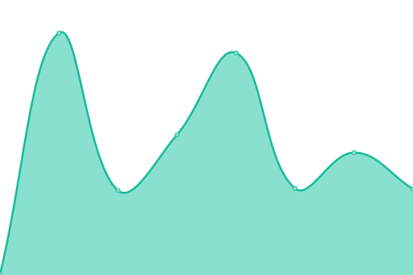
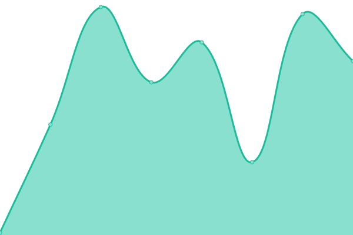

# [📈 Live Status](https://JReyesPetroil.github.io/upptime): <!--live status--> **🟩 All systems operational**

This repository contains the open-source uptime monitor and status page for [JReyesPetroil](https://JReyesPetroil.github.io/upptime), powered by [Upptime](https://github.com/upptime/upptime).

With [Upptime](https://upptime.js.org), you can get your own unlimited and free uptime monitor and status page, powered entirely by a GitHub repository. We use [Issues](https://github.com/JReyesPetroil/upptime/issues) as incident reports, [Actions](https://github.com/JReyesPetroil/upptime/actions) as uptime monitors, and [Pages](https://JReyesPetroil.github.io/upptime) for the status page.

<!--start: status pages-->
<!-- This summary is generated by Upptime (https://github.com/upptime/upptime) -->
<!-- Do not edit this manually, your changes will be overwritten -->
<!-- prettier-ignore -->
| URL | Status | History | Response Time | Uptime |
| --- | ------ | ------- | ------------- | ------ |
|  [SIPP](https://sipp.petroil.com.mx/login.html) | 🟩 Up | [sipp.yml](https://github.com/JReyesPetroil/upptime/commits/HEAD/history/sipp.yml) | 

 218ms
     
 | 

<a href="https://estatus.petroil.dev/history/sipp">100.00%</a>
    

|  [Portal de Clientes](https://asociados.petroil.com.mx) | 🟩 Up | [portal-de-clientes.yml](https://github.com/JReyesPetroil/upptime/commits/HEAD/history/portal-de-clientes.yml) | 

 105ms
     
 | 

<a href="https://estatus.petroil.dev/history/portal-de-clientes">100.00%</a>
    

|  [Gitlab](https://git.grupopetroil.com.mx) | 🟩 Up | [gitlab.yml](https://github.com/JReyesPetroil/upptime/commits/HEAD/history/gitlab.yml) | 

 306ms
     
 | 

<a href="https://estatus.petroil.dev/history/gitlab">100.00%</a>
    

|  [HelpDesk](https://soporte.petroil.dev) | 🟩 Up | [help-desk.yml](https://github.com/JReyesPetroil/upptime/commits/HEAD/history/help-desk.yml) | 

 212ms
     
 | 

<a href="https://estatus.petroil.dev/history/help-desk">100.00%</a>
    

|  [ProyectosTI](https://proyectos.petroil.dev) | 🟩 Up | [proyectos-ti.yml](https://github.com/JReyesPetroil/upptime/commits/HEAD/history/proyectos-ti.yml) | 

 306ms
     
 | 

<a href="https://estatus.petroil.dev/history/proyectos-ti">100.00%</a>
    

|  [OdooCRM](https://crm.grupopetroil.com.mx/web/login) | 🟩 Up | [odoo-crm.yml](https://github.com/JReyesPetroil/upptime/commits/HEAD/history/odoo-crm.yml) | 

 500ms
     
 | 

<a href="https://estatus.petroil.dev/history/odoo-crm">100.00%</a>
    

|  [Pyxoom](https://pyxoom.grupopetroil.com.mx/Helper/Home/Login) | 🟩 Up | [pyxoom.yml](https://github.com/JReyesPetroil/upptime/commits/HEAD/history/pyxoom.yml) | 

 301ms
     
 | 

<a href="https://estatus.petroil.dev/history/pyxoom">100.00%</a>
    

|  [CPanel Paginas web](https://petroil.com.mx) | 🟩 Up | [c-panel-paginas-web.yml](https://github.com/JReyesPetroil/upptime/commits/HEAD/history/c-panel-paginas-web.yml) | 

 756ms
     
 | 

<a href="https://estatus.petroil.dev/history/c-panel-paginas-web">100.00%</a>
    

|  [Rentabilidad](https://api.grupopetroil.com.mx/v1/rentabilidad) | 🟩 Up | [rentabilidad.yml](https://github.com/JReyesPetroil/upptime/commits/HEAD/history/rentabilidad.yml) | 

 414ms
     
 | 

<a href="https://estatus.petroil.dev/history/rentabilidad">100.00%</a>
    

|  [Tableros](https://api.grupopetroil.com.mx/v1/dashboards) | 🟩 Up | [tableros.yml](https://github.com/JReyesPetroil/upptime/commits/HEAD/history/tableros.yml) | 

 42ms
     
 | 

<a href="https://estatus.petroil.dev/history/tableros">100.00%</a>
    

|  [Personal](https://api.grupopetroil.com.mx/v1/personal/health) | 🟩 Up | [personal.yml](https://github.com/JReyesPetroil/upptime/commits/HEAD/history/personal.yml) | 

 87ms
     
 | 

<a href="https://estatus.petroil.dev/history/personal">100.00%</a>
    

|  [Moodle Estudios Profesionales](https://elearning.imexaa.mx/) | 🟩 Up | [moodle-estudios-profesionales.yml](https://github.com/JReyesPetroil/upptime/commits/HEAD/history/moodle-estudios-profesionales.yml) | 

 302ms
     
 | 

<a href="https://estatus.petroil.dev/history/moodle-estudios-profesionales">100.00%</a>
    

<!--end: status pages-->

[**Visit our status website →**](https://JReyesPetroil.github.io/upptime)

## 📄 License

- Powered by: [Upptime](https://github.com/upptime/upptime)
- Code: [MIT](./LICENSE) © [JReyesPetroil](https://JReyesPetroil.github.io/upptime)
- Data in the `./history` directory: [Open Database License](https://opendatacommons.org/licenses/odbl/1-0/)
